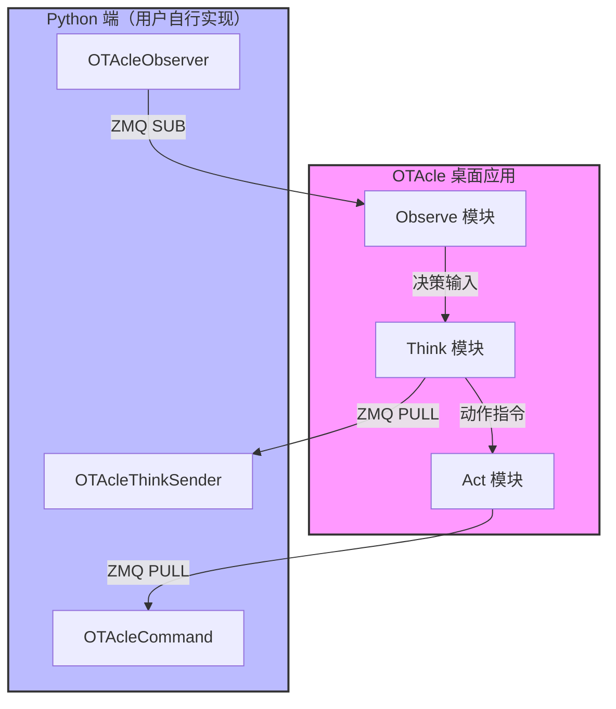

# OTAcle


## 技术栈

| 层次     | 技术                 | 说明                              |
| ------ | ------------------ | ------------------------------- |
| 前端框架   | Vue 3 + TypeScript | 响应式 UI，使用 `<script setup>` SFCs |
| 构建工具   | Vite               | 快速开发服务器和构建                      |
| 桌面包装   | Tauri 2            | Rust 后端 + WebView2 前端           |
| 样式     | Tailwind CSS v4    | 原子化 CSS                         |
| 进程通信   | ZeroMQ             | PUSH-PULL / PUB-SUB 模式          |
| 截图 API | windows-capture    | Windows Graphics Capture API    |

## 模块架构

OTAcle 由三个核心模块组成，形成 **Observe-Think-Act** 闭环：



### Observe 模块 — 视觉输入

采集目标窗口截图，按配置缩放后通过 ZMQ PUB 发送给 Python 端。

- **数据流**：窗口截图 → 缩放/裁切 → Base64 编码 → ZMQ PUB → Python SUB
- **ZMQ 地址**：`tcp://127.0.0.1:5556`（可配置）
- **前端事件**：`observe:frame`、`observe:full_frame`、`observe:error`

### Think 模块 — 决策可视化

接收来自 Python 端的决策日志并可视化。

- **数据流**：Python PUSH → ZMQ PULL → 前端可视化
- **ZMQ 地址**：`tcp://127.0.0.1:5557`（可配置）
- **支持图表类型**：Line、Bar、Area、Gauge
- **前端事件**：`think:decision_log`、`think:error`

### Act 模块 — 动作执行

接收 Python 端的动作命令，在目标窗口上执行输入操作。

- **数据流**：Python PUSH → ZMQ PULL → 解析 → 输入执行
- **ZMQ 地址**：`tcp://127.0.0.1:5555`（可配置）
- **支持 7 种动作类型**：`key`、`key_sequence`、`mouse_click`、`mouse_move`、`mouse_scroll`、`delay`、`text`
- **输入后端**：`win32`（Windows API，可后台执行）、`enigo`（前台窗口）
- **前端事件**：`action:log`、`action:error`

## 项目结构

```
OTAcle/
├── desktop/                      # 主应用目录
│   ├── src/                      # 前端源码（Vue 3 + TypeScript）
│   │   ├── main.ts               # 前端入口
│   │   ├── App.vue               # 根组件
│   │   ├── router/index.ts       # Vue Router 配置
│   │   ├── pages/                # 页面组件
│   │   │   ├── observe/          # Observe 页面
│   │   │   ├── think/            # Think 页面
│   │   │   └── act/              # Act 页面
│   │   ├── components/           # 可复用组件
│   │   │   ├── ui/               # 基础 UI 组件
│   │   │   ├── act/              # Act 相关组件
│   │   │   ├── observe/          # Observe 相关组件
│   │   │   ├── think/            # Think 相关组件
│   │   │   └── dialog/           # 对话框组件
│   │   ├── composables/           # Vue Composables
│   │   │   ├── act/              # Act 模块 composables
│   │   │   ├── observe/          # Observe 模块 composables
│   │   │   └── think/            # Think 模块 composables
│   │   ├── types/index.ts        # TypeScript 类型定义
│   │   └── utils/                # 工具函数
│   └── src-tauri/                # Rust 后端
│       ├── src/
│       │   ├── main.rs           # 二进制入口
│       │   ├── lib.rs            # 库入口，Tauri 构建配置
│       │   ├── commands/         # Tauri 命令
│       │   │   ├── action.rs     # 动作相关命令
│       │   │   ├── observe.rs    # Observe 相关命令
│       │   │   ├── think.rs      # Think 相关命令
│       │   │   ├── project.rs    # 项目管理命令
│       │   │   └── window_*.rs   # 窗口操作命令
│       │   ├── act/              # Act 模块核心
│       │   │   ├── types.rs      # 动作类型定义
│       │   │   ├── config.rs     # 配置加载/保存
│       │   │   ├── executor.rs   # 动作执行器
│       │   │   ├── history.rs    # 撤销/重做历史
│       │   │   └── validation.rs # 配置验证
│       │   ├── observe/          # Observe 模块核心
│       │   │   ├── capture.rs    # Windows Graphics Capture 封装
│       │   │   ├── processor.rs  # 图像缩放/裁切处理
│       │   │   └── status.rs     # 运行状态管理
│       │   ├── think/            # Think 模块核心
│       │   ├── communication/    # 统一 ZMQ 通信
│       │   │   ├── puller.rs     # ZMQ PULL 接收
│       │   │   └── publisher.rs  # ZMQ PUB 发布
│       │   ├── input/            # 输入控制
│       │   │   ├── win32_input.rs # Win32 API 实现
│       │   │   ├── enigo.rs      # Enigo 库实现
│       │   │   └── find_window.rs # 窗口查找
│       │   └── project/          # 项目管理
│       └── tauri.conf.json      # Tauri 配置
├── py_tool/                      # Python SDK
│   └── src/otacle/
│       └── otacle.py            # 主要类：OTAcleCommand、OTAcleObserver、OTAcleThinkSender
└── README.md
```

## 安装

### 前置条件

- **Node.js** 18+（用于前端开发）
- **Rust** 1.75+（用于 Tauri 后端编译）
- **pnpm** 8+（包管理器）
- **Windows 10/11**（当前仅支持 Windows）

### 安装步骤

1. 克隆仓库
   
   ```bash
   git clone https://github.com/yourname/otacle.git
   cd otacle
   ```

2. 安装前端依赖
   
   ```bash
   cd desktop
   pnpm install
   ```

3. 配置 Rust 环境（首次运行时 Tauri 会自动下载 Rust）

4. 运行开发服务器
   
   ```bash
   pnpm tauri dev
   ```

## 开发命令

### 前端开发

```bash
cd desktop

pnpm dev              # 启动 Vite 开发服务器（端口 1420）
pnpm build            # TypeScript 类型检查 + Vite 构建
pnpm preview          # 预览生产构建
pnpm tauri dev        # 以开发模式启动完整的 Tauri 应用
pnpm tauri build      # 构建生产版本 Tauri 应用
```

### Rust 后端

```bash
cd desktop/src-tauri

cargo check           # Rust 类型检查
cargo build           # Rust 编译
cargo test            # 运行所有测试
cargo test test_name  # 运行单个测试
cargo clippy          # Rust linter
```

### 代码检查

```bash
cd desktop

pnpm lint             # ESLint 检查
pnpm lint:fix         # ESLint 自动修复
pnpm knip             # 死代码检查
```

## Python SDK

OTAcle 提供 Python SDK（`py_tool/`）用于与桌面应用通信。

### 安装

```bash
# 可编辑模式（开发用）
pip install -e py_tool/

# 或构建 wheel 后安装
cd py_tool && pip install build && python -m build && pip install dist/otacle-*.whl
```

### 核心类

| 类                   | ZMQ 模式        | 用途     |
| ------------------- | ------------- | ------ |
| `OTAcleCommand`     | PUSH → Act    | 发送动作命令 |
| `OTAcleObserver`    | SUB ← Observe | 接收图像帧  |
| `OTAcleThinkSender` | PUSH → Think  | 发送决策日志 |

### 使用示例

**发送动作命令：**

```python
from otacle import OTAcleCommand

with OTAcleCommand() as cmd:
    cmd.execute([0, 2])                       # 执行 index 0 和 2 的动作
    cmd.set_params({"target_x": 100, "target_y": 200})  # 动态参数
    cmd.send()
```

**接收图像帧：**

```python
from otacle import OTAcleObserver

with OTAcleObserver() as observer:
    for frame in observer:
        print(f"帧 {frame.frame_id}: {frame.width}x{frame.height}")
        for block in frame.data:
            print(f"  裁切块: ({block.x}, {block.y}) {block.w}x{block.h}")
```

**发送决策日志：**

```python
from otacle import OTAcleThinkSender

with OTAcleThinkSender() as sender:
    sender.send_step(1, reward=1.0, epsilon=0.1)
    sender.send_step(2, reward=0.5, loss=0.2)
```

## 动作配置

动作配置文件为 JSON 格式（默认为项目目录的 `.otacle/actions.json`）。

### 配置格式

```json
{
  "default_backend": "win32",
  "actions": [
    {
      "index": 0,
      "name": "jump",
      "type": "key",
      "key": "space",
      "hold_time_ms": 5
    },
    {
      "index": 1,
      "name": "move_to_target",
      "type": "mouse_move",
      "x": 0,
      "y": 0,
      "variables": [
        {"param_name": "target_x", "field_name": "x"},
        {"param_name": "target_y", "field_name": "y"}
      ]
    }
  ]
}
```

### 动作类型详解

| 类型             | 说明   | 关键字段                                        |
| -------------- | ---- | ------------------------------------------- |
| `key`          | 单键按下 | `key`（按键名），`hold_time_ms`（按住时长）             |
| `key_sequence` | 按键序列 | `keys[]`（按键列表），`default_interval_ms`（间隔）    |
| `mouse_click`  | 鼠标点击 | `button`（left/right/middle），`count`（次数），`x`, `y`（坐标） |
| `mouse_move`   | 鼠标移动 | `x`, `y`（坐标），`duration_ms`（移动时长）            |
| `mouse_scroll` | 鼠标滚动 | `direction`（up/down/left/right），`amount`（量） |
| `delay`        | 延时等待 | `duration_ms`（毫秒）                           |
| `text`         | 文本输入 | `content`（文本内容）                             |

### 动态参数替换

通过 `variables` 字段定义可在运行时替换的参数：

```json
{
  "type": "mouse_move",
  "x": 0,
  "y": 0,
  "variables": [
    {"param_name": "target_x", "field_name": "x"},
    {"param_name": "target_y", "field_name": "y"}
  ]
}
```

发送命令时通过 `params` 替换：

```python
cmd.set_params({"target_x": 100, "target_y": 200})
```

### 输入后端

| 后端      | 模式          | 说明                           |
| ------- | ----------- | ---------------------------- |
| `win32` | Windows API | 可定向发送到后台窗口，使用 `PostMessageW` |
| `enigo` | Enigo 库     | 跨平台，依赖前台窗口                   |

优先级：`action.backend` > `default_backend`

## 窗口定位语法

执行动作时可指定目标窗口：

| 格式                  | 说明              | 示例                  |
| ------------------- | --------------- | ------------------- |
| `"Notepad"`         | 窗口标题前缀匹配        | `"Notepad"`         |
| `"id:395542"`       | 直接指定 HWND（十进制）  | `"id:395542"`       |
| `"id:0x9999"`       | 直接指定 HWND（十六进制） | `"id:0x9999"`       |
| `"class:Notepad"`   | 窗口类名            | `"class:Notepad"`   |
| `"exe:notepad.exe"` | 进程名             | `"exe:notepad.exe"` |
| `"pid:1234"`        | 进程 ID           | `"pid:1234"`        |
| `"A"` 或空            | 当前前台窗口          | `"A"`               |

## 通信配置

通信配置（`.otacle/comm.json`）：

```json
{
  "act_pull_address": "tcp://127.0.0.1:5555",
  "observe_pub_address": "tcp://127.0.0.1:5556",
  "think_pull_address": "tcp://127.0.0.1:5557"
}
```

### ZMQ 消息格式

**Act 模块（接收命令）：**

```json
{
  "execute": [true, false, true],
  "params": {"target_x": 100, "target_y": 200}
}
```

**Observe 模块（发送帧）：**

```json
{
  "width": 640,
  "height": 480,
  "timestamp": 1713000000000,
  "frame_id": 12345,
  "data": [
    {"x": 0, "y": 0, "w": 320, "h": 240, "image": "base64..."}
  ]
}
```

**Think 模块（接收决策日志）：**

```json
{
  "step": 1,
  "custom": {"reward": 1.0, "epsilon": 0.1}
}
```

## 项目管理

OTAcle 使用项目目录管理配置，每个项目包含：

```
my_project/
├── .otacle/              # OTAcle 配置目录
│   ├── actions.json      # 动作配置
│   ├── observe.json      # Observe 配置
│   ├── think.json        # Think 配置
│   └── comm.json         # 通信配置
├── game.py               # 你的强化学习代码
└── model.py              # 你的模型代码
```

## Tauri 命令列表

### Action 命令

| 命令                               | 说明        |
| -------------------------------- | --------- |
| `act_load_config`                | 加载动作配置    |
| `act_get_list`                   | 获取动作列表    |
| `act_get_default_backend`        | 获取默认输入后端  |
| `act_set_default_backend`        | 设置默认输入后端  |
| `act_create`                     | 创建新动作     |
| `act_update`                     | 更新动作      |
| `act_delete`                     | 删除动作      |
| `act_save_config`                | 保存动作配置    |
| `act_execute_action`             | 执行单个动作    |
| `act_execute_action_with_params` | 带参数执行动作   |
| `act_undo`                       | 撤销        |
| `act_redo`                       | 重做        |
| `act_get_history_status`         | 获取撤销/重做状态 |

### Observe 命令

| 命令                           | 说明      |
| ---------------------------- | ------- |
| `observe_start`              | 启动截图捕获  |
| `observe_stop`               | 停止捕获    |
| `observe_get_status`         | 获取运行状态  |
| `observe_save_config`        | 保存配置    |
| `observe_load_config`        | 加载配置    |
| `observe_capture_preview`    | 捕获单帧预览  |
| `observe_capture_full_frame` | 捕获完整帧预览 |

### Think 命令

| 命令                  | 说明       |
| ------------------- | -------- |
| `think_start`       | 启动决策日志接收 |
| `think_stop`        | 停止接收     |
| `think_get_status`  | 获取运行状态   |
| `think_load_config` | 加载配置     |
| `think_save_config` | 保存配置     |
| `think_get_logs`    | 获取日志列表   |

### 窗口命令

| 命令                     | 说明      |
| ---------------------- | ------- |
| `window_set_target`    | 设置目标窗口  |
| `window_get_target`    | 获取目标窗口  |
| `window_list`          | 列出所有窗口  |
| `window_find_by_title` | 按标题查找窗口 |
| `window_get_info`      | 获取窗口信息  |

## 用户指南

本指南面向 **AI 强化学习研究者** 和 **自动化测试开发者**，帮助你使用 OTAcle 构建自己的 Observe-Think-Act 闭环系统。

---

### 一、快速开始

#### 1. 启动桌面应用

```bash
cd desktop
pnpm tauri dev
```

应用启动后，你会看到三个主要页面：**Observe**（视觉输入）、**Think**（决策可视化）、**Act**（动作执行）。

#### 2. 创建或打开项目

项目是一个普通文件夹，但需要包含 `.otacle/` 配置目录。

桌面应用支持：
- **新建项目**：创建空白项目结构
- **打开现有项目**：打开 `example/` 演示项目

#### 3. 运行演示

```bash
cd example
python demo.py
```

演示脚本每秒执行一次循环：接收图像帧 → 分析像素 → 发送决策日志 → 根据条件触发动作。

---

### 二、核心概念

OTAcle 模拟强化学习的 **Observe-Think-Act** 闭环：

```
┌─────────────────────────────────────────────────────────┐
│                      OTAcle 桌面应用                      │
│                                                         │
│   ┌───────────┐     ┌───────────┐     ┌───────────┐    │
│   │ Observe   │────▶│  Think    │────▶│   Act     │    │
│   │ 视觉输入    │     │ 决策可视化  │     │ 动作执行    │    │
│   └───────────┘     └───────────┘     └───────────┘    │
│        │                 │                 │           │
│        │ ZMQ PUB         │ ZMQ PULL        │ ZMQ PULL  │
│        ▼                 ▼                 ▼           │
└─────────────────────────────────────────────────────────┘
        │                                      │
        └────────────── Python AI ─────────────┘
                    （你需要编写）
```

| 模块 | 职责 | ZMQ 端口 |
|------|------|----------|
| **Observe** | 捕获目标窗口截图，发送给 Python | 5556 (PUB) |
| **Think** | 接收 Python 的决策日志并可视化 | 5557 (PULL) |
| **Act** | 接收 Python 的动作命令并执行 | 5555 (PULL) |

**你只需要编写 Python 端代码**（即"AI Agent"），桌面应用负责与系统交互。

---

### 三、项目结构

```
my_project/                  # 你的项目目录
├── .otacle/                 # OTAcle 配置（由桌面应用管理）
│   ├── actions.json        # 动作配置
│   ├── observe.json        # 截图区域配置
│   ├── think.json          # 可视化配置
│   └── comm.json           # ZMQ 通信地址
├── game.py                 # 游戏环境/业务逻辑
├── agent.py                # AI 智能体
└── train.py                # 训练主循环
```

桌面应用会在 `.otacle/` 目录下生成配置文件，你可以修改它们来调整行为。

---

### 四、编写你的 AI Agent

#### 4.1 安装 Python SDK

```bash
pip install -e py_tool/
```

或在代码中直接引用：

```python
import sys
sys.path.insert(0, "../py_tool/src")
from otacle import OTAcleCommand, OTAcleObserver, OTAcleThinkSender
```

#### 4.2 完整示例

以下是一个完整的 AI Agent 示例，实现简单的"按条件触发动作"逻辑：

```python
# -*- coding: utf-8 -*-
"""
我的 AI Agent
"""

import sys
sys.path.insert(0, "../py_tool/src")

from otacle import OTAcleCommand, OTAcleObserver, OTAcleThinkSender

def get_pixel_rgb(image_bytes: bytes, x: int, y: int, width: int) -> tuple[int, int, int]:
    """从图像字节数据中获取 (x, y) 位置的 RGB 值（BGRA 格式）"""
    idx = (y * width + x) * 4
    b, g, r = image_bytes[idx], image_bytes[idx + 1], image_bytes[idx + 2]
    return (r, g, b)

def main():
    print("启动 AI Agent...")

    # 初始化三个模块
    observer = OTAcleObserver()  # 接收图像帧
    sender = OTAcleThinkSender() # 发送决策日志
    cmd = OTAcleCommand()        # 发送动作命令

    observer.start()
    sender.start()

    step = 0

    try:
        while True:
            step += 1

            # --- Observe: 接收图像帧 ---
            frame = observer.recv(timeout=100)
            if frame:
                # 分析第一个裁切块 (1, 1) 位置的像素
                block = frame.data[0]
                img_bytes = block.decode_image()
                r, g, b = get_pixel_rgb(img_bytes, 1, 1, block.w)
                rgb_sum = r + g + b

                print(f"Step {step}: RGB总和 = {rgb_sum}")

                # 条件触发：如果 RGB 总和大于 200，执行动作
                if rgb_sum > 200:
                    cmd.clear_execute()
                    cmd.execute([0])  # 执行动作 0
                    cmd.send()
                    print(f"  -> 触发动作 0")

            # --- Think: 发送决策日志 ---
            reward = 1.0 / step
            epsilon = max(0.01, 1.0 / step)
            sender.send_step(step, reward=reward, epsilon=epsilon)

            # 模拟计算延时
            import time
            time.sleep(0.5)

    except KeyboardInterrupt:
        print("\nAgent 停止")
    finally:
        observer.stop()
        sender.stop()
        cmd.close()

if __name__ == "__main__":
    main()
```

#### 4.3 动作配置说明

在桌面应用的 **Act 页面** 配置动作，保存到 `.otacle/actions.json`：

```json
{
  "default_backend": "win32",
  "actions": [
    {
      "index": 0,
      "name": "jump",
      "type": "key",
      "key": "space",
      "hold_time_ms": 5
    }
  ]
}
```

**常用动作类型：**

| 类型 | 说明 | 关键字段 |
|------|------|----------|
| `key` | 按键按下 | `key`, `hold_time_ms` |
| `key_sequence` | 按键序列 | `keys[]`, `default_interval_ms` |
| `mouse_click` | 鼠标点击 | `button`, `count`, `x`, `y` |
| `mouse_move` | 鼠标移动 | `x`, `y`, `duration_ms` |
| `mouse_scroll` | 鼠标滚动 | `direction`, `amount` |
| `delay` | 延时等待 | `duration_ms` |
| `text` | 文本输入 | `content` |

**支持动态参数的动作配置：**

```json
{
  "index": 1,
  "name": "move_to",
  "type": "mouse_move",
  "x": 0,
  "y": 0,
  "variables": [
    {"param_name": "target_x", "field_name": "x"},
    {"param_name": "target_y", "field_name": "y"}
  ]
}
```

Python 端发送参数：

```python
cmd.execute([1])                    # 执行动作 1
cmd.set_params({"target_x": 100, "target_y": 200})
cmd.send()
```

---

### 五、ZMQ 通信地址

默认地址在 `py_tool/src/otacle/otacle.py` 中定义：

| 模块 | 默认地址 | 说明 |
|------|----------|------|
| Act | `tcp://127.0.0.1:5555` | Python → Act（发送动作命令） |
| Observe | `tcp://127.0.0.1:5556` | Observe → Python（发送图像帧） |
| Think | `tcp://127.0.0.1:5557` | Python → Think（发送决策日志） |

可通过构造函数覆盖：

```python
cmd = OTAcleCommand(address="tcp://127.0.0.1:5555")
observer = OTAcleObserver(address="tcp://127.0.0.1:5556")
sender = OTAcleThinkSender(address="tcp://127.0.0.1:5557")
```

或通过 `.otacle/comm.json` 配置文件统一管理。

---

### 六、常见问题

**Q: 动作在后台窗口无法执行？**
A: 使用 `win32` 后端（默认），它通过 `PostMessageW` 向后台窗口发送消息。`enigo` 后端需要前台窗口。

**Q: 如何调试动作是否正确配置？**
A: 在 Act 页面点击"执行"按钮直接测试动作，确认行为后再在 Python 端调用。

**Q: 图像帧接收频率太低？**
A: 检查 `observe.json` 中的 `frame_rate` 设置，或降低 `target_width`/`target_height` 减少数据传输量。

**Q: 可以同时运行多个项目吗？**
A: 不可以，每个 ZMQ 地址只能被一个消费者绑定。请确保同一时间只有一个 Python 进程连接。

**Q: 如何添加新的动作类型？**
A: 目前动作类型在 `desktop/src-tauri/src/act/types.rs` 中定义。如需扩展，需要修改 Rust 后端代码。

---

### 七、进阶主题

#### 7.1 窗口定位语法

Act 模块执行动作时可以指定目标窗口：

| 格式 | 说明 | 示例 |
|------|------|------|
| `"Notepad"` | 窗口标题前缀匹配 | `"Notepad"` |
| `"id:395542"` | HWND 十进制 | `"id:395542"` |
| `"id:0x9999"` | HWND 十六进制 | `"id:0x9999"` |
| `"class:Notepad"` | 窗口类名 | `"class:Notepad"` |
| `"exe:notepad.exe"` | 进程名 | `"exe:notepad.exe"` |
| `"pid:1234"` | 进程 ID | `"pid:1234"` |
| `"A"` 或空 | 当前前台窗口 | `"A"` |

#### 7.2 自定义裁切区域

在 `observe.json` 中配置多个裁切区域，只发送你关心的屏幕部分：

```json
{
  "capture": {
    "frame_rate": 10,
    "target_width": 320,
    "target_height": 240
  },
  "crop_regions": [
    {"x": 0, "y": 0, "w": 160, "h": 120},
    {"x": 160, "y": 0, "w": 160, "h": 120}
  ]
}
```

#### 7.3 决策日志可视化

Think 模块支持自定义字段，可在 `think.json` 中配置显示哪些指标：

```json
{
  "displays": [
    {"key": "reward", "type": "line", "name": "奖励"},
    {"key": "epsilon", "type": "gauge", "name": "探索率"}
  ]
}
```

Python 端发送：

```python
sender.send_step(step, reward=0.85, epsilon=0.15, loss=0.02)
```

---

## 命名规范

### Rust 后端

| 类别       | 风格                  | 示例                         |
| -------- | ------------------- | -------------------------- |
| 文件/模块    | snake_case          | `zmq_pull.rs`              |
| 类型       | PascalCase          | `ZmqCommand`, `ActionData` |
| Tauri 命令 | snake_case，前缀模块名下划线 | `act_load_config`          |
| 枚举成员     | PascalCase          | `InputBackend::Win32`      |
| 动作类型标签   | snake_case 字符串      | `"key"`, `"mouse_click"`   |
| JSON 字段  | snake_case          | `hold_time_ms`             |

### TypeScript/Vue 前端

| 类别            | 风格                      | 示例                     |
| ------------- | ----------------------- | ---------------------- |
| Vue SFC 文件    | PascalCase              | `ActPage.vue`          |
| 目录/嵌套组件       | kebab-case              | `components/nav/`      |
| TypeScript 类型 | PascalCase              | `interface ActionItem` |
| Composable 函数 | camelCase + `use` 前缀    | `useLog()`             |
| 事件处理函数        | camelCase + `handle` 前缀 | `handleSave()`         |

## 许可证

MIT
