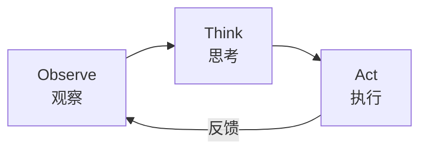
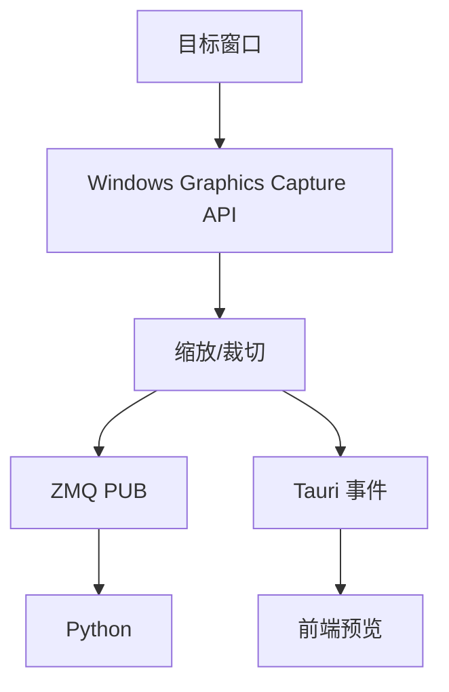
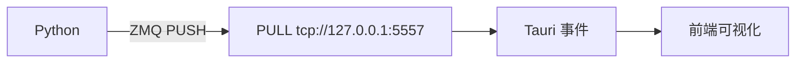
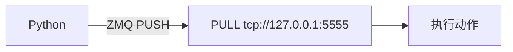

# OTAcle

**OTAcle** — Observe-Think-Act cycle，强化学习流程控制桌面应用。

核心理念：只做**流程控制和可视化**，不提供任何算法、训练代码、图像处理方法。算法部分由用户自己准备，OTAcle 负责把它们串联起来。

## 核心概念

OTAcle 实现了一个无限循环的 **OTA** 流程：

OTAcle 实现了一个无限循环的 **OTA** 流程：



| 模块 | 职责 | 与 Python 的通信 |
|------|------|-----------------|
| **Observe** | 采集目标窗口截图 | ZMQ PUB → `tcp://127.0.0.1:5556` |
| **Think** | 可视化决策日志 | ZMQ PULL ← `tcp://127.0.0.1:5557` |
| **Act** | 执行键盘鼠标动作 | ZMQ PULL ← `tcp://127.0.0.1:5555` |

### 窗口定位语法

执行动作时可指定目标窗口，使用以下格式：

| 格式 | 示例 | 说明 |
|------|------|------|
| `""` 或 `"A"` | `""`, `"A"` | 当前前台窗口 |
| `"id:<hwnd>"` | `"id:0x12345"`, `"id:395542"` | 直接 HWND（十六进制或十进制） |
| `"class:<name>"` | `"class:Notepad"` | 窗口类名 |
| `"pid:<number>"` | `"pid:1234"` | 进程 ID |
| `"exe:<name>"` | `"exe:notepad.exe"` | 进程名 |
| `"<title>"` | `"Untitled - Notepad"` | 窗口标题前缀匹配 |

---

## 技术栈

| 层级 | 技术 | 说明 |
|------|------|------|
| **前端框架** | Vue 3 + TypeScript | 组合式 API (`<script setup>`) |
| **构建工具** | Vite 6 | 开发服务器端口 1420 |
| **桌面包装** | Tauri 2 | Rust 后端 + WebView2 |
| **样式** | Tailwind CSS v4 | CSS-first 配置方式 |
| **图表** | ECharts 6 | Think 模块数据可视化 |
| **后端** | Rust | 动作执行、窗口截图、ZMQ 通信 |
| **进程间通信** | ZeroMQ | PUSH-PULL / PUB-SUB 模式 |

---

## 快速开始

### 环境要求

- **Node.js** 18+
- **Rust** 1.75+
- **Python** 3.10+（用于集成）
- **Windows** 10/11（桌面应用）

### 安装步骤

```bash
# 克隆项目
git clone https://github.com/your/OTAcle.git
cd OTAcle

# 安装前端依赖
cd desktop
pnpm install

# 启动开发服务器（仅前端）
pnpm dev

# 或启动完整的 Tauri 应用（开发模式）
pnpm tauri dev
```

### 构建生产版本

```bash
cd desktop
pnpm tauri build
```

---

## 系统架构

### 目录结构

```
OTAcle/
├── desktop/
│   ├── src/                      # Vue 3 前端
│   │   ├── main.ts              # 入口文件
│   │   ├── App.vue              # 根组件
│   │   ├── router/              # Vue Router
│   │   ├── pages/               # 页面组件
│   │   │   ├── act/             # Act 页面
│   │   │   ├── observe/         # Observe 页面
│   │   │   └── think/           # Think 页面
│   │   ├── components/           # UI 组件
│   │   ├── composables/          # 组合式函数（状态管理）
│   │   │   ├── act/             # 动作编辑/执行/历史
│   │   │   ├── observe/          # 截图控制
│   │   │   └── think/           # 决策日志
│   │   ├── types/               # TypeScript 类型定义
│   │   └── styles/              # CSS 样式
│   └── src-tauri/               # Rust 后端
│       ├── src/
│       │   ├── lib.rs          # Tauri 应用入口
│       │   ├── commands/       # Tauri IPC 命令
│       │   ├── act/           # 动作配置与执行
│       │   ├── observe/       # 窗口截图
│       │   ├── think/         # 决策日志接收
│       │   ├── communication/  # ZeroMQ 通信
│       │   └── input/         # 键盘鼠标输入
│       └── tauri.conf.json    # Tauri 配置
└── example/
    └── python/
        └── otacle.py          # Python ZMQ 辅助模块
```

### 前后端通信

前端通过 Tauri IPC 调用 Rust 命令：

```typescript
import { invoke } from "@tauri-apps/api/core";

// 调用 Rust 命令
const result = await invoke("act_load_config", { path: "./actions.json" });
```

Rust 端注册命令：

```rust
#[tauri::command]
fn act_load_config(path: &str) -> Result<(), String> {
    // ...
}

tauri::Builder::default()
    .invoke_handler(tauri::generate_handler![act_load_config])
```

---

## Observe 模块

**核心理念**：作为 OTAcle 的"眼睛"，采集目标窗口截图并向 Python 端提供视觉输入。

### 数据流



### 核心类型

**FrameMessage** — 发送给 Python 的图像帧：

```json
{
  "width": 640,
  "height": 480,
  "timestamp": 1713000000000,
  "frame_id": 12345,
  "data": [
    {
      "x": 0,
      "y": 0,
      "w": 320,
      "h": 240,
      "image": "base64encoded..."
    }
  ]
}
```

### 配置项

| 参数 | 默认值 | 说明 |
|------|--------|------|
| `frame_rate` | 3 | 捕获帧率（FPS） |
| `target_width` | 640 | 目标图像宽度 |
| `target_height` | 480 | 目标图像高度 |
| `crop_regions` | [] | 裁切区域列表 |

---

## Think 模块

**核心理念**：作为 OTAcle 的"大脑"，接收并可视化来自 Python 端的决策日志。

### 数据流



### 核心类型

**DecisionLog** — Python 发送的决策日志：

```json
{
  "step": 12345,
  "custom": {
    "q_values": {"left": 0.5, "right": 0.8},
    "reward": 1.2,
    "epsilon": 0.1
  }
}
```

### 配置项

| 参数 | 默认值 | 说明 |
|------|--------|------|
| `max_data_points` | 1000 | 环形缓冲区最大数据点数 |
| `display_fields` | [] | 可视化字段配置 |

**DisplayField** — 单个字段的可视化配置：

```json
{
  "name": "reward",
  "title": "奖励值",
  "chart_type": "line"
}
```

`chart_type` 支持：`line` | `bar` | `area` | `gauge`

---

## Act 模块

**核心理念**：作为 OTAcle 的"手"，执行键盘鼠标动作。

### 数据流



### 命令格式

```json
{
  "execute": [true, false, true],
  "params": {
    "target_x": 100,
    "target_y": 200
  }
}
```

### 动作配置示例

```json
{
  "default_backend": "win32",
  "actions": [
    {"index": 0, "name": "jump", "type": "key", "key": "space"},
    {"index": 1, "name": "move", "type": "mouse_move", "x": 0, "y": 0,
     "variables": [
       {"param_name": "target_x", "field_name": "x"},
       {"param_name": "target_y", "field_name": "y"}
     ]
    },
    {"index": 2, "name": "scroll", "type": "mouse_scroll", "direction": "up", "amount": 1}
  ]
}
```

### 支持的动作类型

| 类型 | 必需字段 | 可选字段 |
|------|----------|----------|
| `key` | `key` | `hold_time_ms`, `backend` |
| `key_sequence` | `keys[]` | `default_interval_ms`, `backend` |
| `mouse_click` | `button` | `count`, `interval_ms`, `hold_time_ms`, `backend`, `variables` |
| `mouse_move` | `x`, `y` | `duration_ms`, `backend`, `variables` |
| `mouse_scroll` | `direction`, `amount` | `backend` |
| `delay` | `duration_ms` | — |
| `text` | `content` | `backend` |

### 输入后端

| 后端 | 说明 |
|------|------|
| `win32` | Windows API（`PostMessageW`），可定向发送到后台窗口 |
| `enigo` | 跨平台库，依赖前台窗口 |

### 撤销/重做

- 最多保存 50 条历史记录
- `act_undo` — 撤销上一步操作
- `act_redo` — 重做已撤销的操作

---

## Python 集成

### 安装辅助模块

将 `example/python/otacle.py` 复制到你的项目，或直接引用：

```python
import sys
sys.path.insert(0, "path/to/OTAcle/example/python")
from otacle import OTAcleCommand
```

### 基本用法

```python
from otacle import OTAcleCommand

# 方式 1: 上下文管理器（推荐）
with OTAcleCommand() as cmd:
    cmd.execute([0, 2])  # 执行 index 0 和 2 的动作
    cmd.set_params({"target_x": 100, "target_y": 200})
    cmd.send()

# 方式 2: 便捷函数
from otacle import send_command
send_command([0, 2], {"target_x": 100})
```

### 完整强化学习循环示例

```python
from otacle import OTAcleCommand

# 初始化命令构建器
cmd = OTAcleCommand(action_count=5)

# 连接到不同的地址（可选）
# cmd = OTAcleCommand(address="tcp://127.0.0.1:5555")

# 1. 接收 Observe 模块发送的图像帧（需自行实现 ZMQ SUB）
# import zmq
# ctx = zmq.Context()
# sock = ctx.socket(zmq.SUB)
# sock.connect("tcp://127.0.0.1:5556")
# frame = sock.recv_json()

# 2. Think 决策（由你的 RL 算法完成）
# q_values = your_model.decide(state)

# 3. 发送动作命令到 Act 模块
with cmd:
    cmd.clear_execute()
    cmd.execute([0, 3])  # 执行动作 0 和 3
    cmd.set_params({
        "target_x": 500,
        "target_y": 300
    })
    cmd.send()

# 4. 发送决策日志到 Think 模块（可选）
# log = {"step": 1, "custom": {"reward": 1.0}}
# send_think_log(log, address="tcp://127.0.0.1:5557")
```

### OTAcleCommand API

| 方法 | 说明 |
|------|------|
| `execute(indices)` | 按索引指定要执行的动作（追加式） |
| `execute_all()` | 执行所有动作 |
| `clear_execute()` | 清除所有执行标记 |
| `set_action(index, enabled)` | 设置单个动作是否执行 |
| `set_params(params)` | 设置动态参数字典 |
| `add_param(key, value)` | 添加或更新单个参数 |
| `remove_param(key)` | 删除指定参数 |
| `send()` | 发送命令到 ZMQ 地址 |
| `close()` | 关闭 ZMQ 连接 |

---

## 开发指南

### 开发命令

| 命令 | 说明 |
|------|------|
| `pnpm dev` | 启动 Vite 开发服务器（端口 1420） |
| `pnpm build` | TypeScript 类型检查 + Vite 构建 |
| `pnpm preview` | 预览生产构建 |
| `pnpm tauri dev` | 以开发模式启动完整的 Tauri 应用 |
| `pnpm tauri build` | 构建生产版本 Tauri 应用 |
| `pnpm lint` | ESLint 代码检查 |
| `pnpm knip` | 检测未使用的文件/依赖 |

### 代码检查

```bash
cd desktop/src-tauri

# Rust linter
cargo clippy

# 代码格式检查
cargo fmt --check

# 安全漏洞检查（需安装）
cargo install cargo-audit
cargo audit
```

### 前端类型检查

```bash
cd desktop
pnpm build  # 同时运行 TypeScript 检查和 Vite 构建
```

---

## 附录

### ZMQ 端口配置

| 模块 | 类型 | 默认地址 |
|------|------|----------|
| Act | PULL（接收命令） | `tcp://127.0.0.1:5555` |
| Observe | PUB（发送图像） | `tcp://127.0.0.1:5556` |
| Think | PULL（接收日志） | `tcp://127.0.0.1:5557` |

### 常见问题

**Q: 动作没有执行？**
- 检查 ZMQ 连接地址是否正确
- 确认 `execute` 数组中对应索引为 `true`
- 检查 `params` 中的键名是否与 `variables` 中的 `param_name` 匹配

**Q: Observe 截图黑屏？**
- 确保目标窗口可见且未被最小化
- 检查窗口句柄是否正确

**Q: Win32 后端无法发送到后台窗口？**
- 某些窗口可能阻止了 `PostMessage`
- 尝试切换到 `enigo` 后端（需前台窗口）

---

## 许可证

MIT License